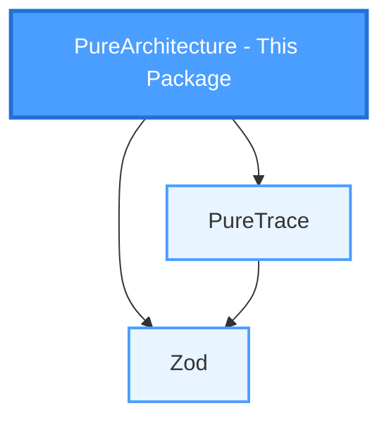
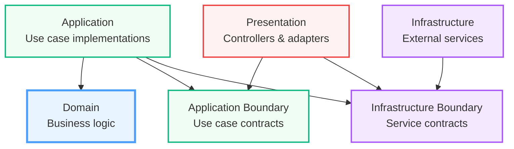

# PureArchitecture

[](https://www.npmjs.com/package/@gilles-coudert/pure-architecture)
[](https://opensource.org/licenses/MPL-2.0)

> Simplified Clean Architecture implementation using PureTrace for TypeScript applications

## Why PureArchitecture?

PureArchitecture provides minimal, type-safe building blocks for implementing Clean Architecture in TypeScript:

- ✅ **Ultra-lightweight** - Only interfaces and factory functions, no runtime overhead
- ✅ **Type-safe** - Full TypeScript support with inference
- ✅ **Framework-agnostic** - Works with Express, Fastify, NestJS, GraphQL, CLI, etc.
- ✅ **Functional** - Uses PureTrace's Result/ResultAsync for error handling
- ✅ **Template Method Pattern** - Controllers use Template Method for extensible request handling
- ✅ **Testable** - Dependency injection friendly
- ✅ **Enforced boundaries** - Includes ESLint config to prevent layer violations

## PureArchitecture in the PureFramework



PureArchitecture depends on:

- [PureTrace](https://www.npmjs.com/package/@gilles-coudert/pure-trace) for functional error handling
- [Zod](https://zod.dev/) for schema validation (request data validation)

## Quick Start

### Installation

```bash
npm install @gilles-coudert/pure-architecture @gilles-coudert/pure-trace zod
```

### Basic Example

```typescript
import {
    PureUseCase,
    PureParameters,
    Requester,
    Locale,
} from '@gilles-coudert/pure-architecture';
import {
    ResultAsync,
    Success,
    generateFailure,
} from '@gilles-coudert/pure-trace';

// 1. Define your requester (authenticated user/actor)
interface User extends Requester {
    id: string;
    preferredLocale: Locale;
    email: string;
}

// 2. Define your use case input
interface CreateTaskInput extends PureParameters<User, { title: string }> {
    requester: User;
    payload: { title: string };
}

// 3. Implement your use case
class CreateTaskInteractor implements PureUseCase<
    CreateTaskInput,
    { title: string },
    { id: string; title: string },
    User
> {
    execute(
        input: CreateTaskInput,
    ): ResultAsync<{ id: string; title: string }> {
        if (!input.payload.title.trim()) {
            return ResultAsync.liftFailure({
                type: 'processError',
                code: 'emptyTitle',
                data: undefined,
            });
        }

        const task = {
            id: crypto.randomUUID(),
            title: input.payload.title,
        };

        return ResultAsync.liftSuccess(task);
    }
}
```

## Controller Pattern: Template Method

PureArchitecture uses the **Template Method pattern** for controllers to provide a flexible, extensible approach to request handling while maintaining a consistent workflow.

### Why Template Method?

The Template Method pattern offers several advantages:

1. **Consistent workflow**: All controllers follow the same execution flow (extract → validate → map → execute → translate → handle)
2. **Customization points**: Developers can override specific steps without reimplementing the entire flow
3. **Separation of concerns**: Each method has a single, well-defined responsibility
4. **Protocol independence**: The core logic is separated from protocol-specific details
5. **Easy testing**: Individual methods can be tested in isolation

### The Controller Workflow

Each `PureController` executes requests through these steps:

```typescript
// 1. initContext(request) - Initialize request tracking context
const context = this.initContext(request);

// 2. extractRequestData(request) - Extract protocol-specific data
const requestData = this.extractRequestData(request);

// 3. Validate against Zod schema (automatic)
const validatedData = pureZodParse(requestData, schema);

// 4. mapper.to(validatedData) - Map to use case input
const useCaseInput = mapper.to(validatedData);

// 5. interactor.execute(useCaseInput) - Execute use case
const result = await interactor.execute(useCaseInput);

// 6. translator.translate() - Translate messages (automatic)
for (const trace of result.getTraces()) {
    translator.translate(trace, preferredLocale);
}

// 7. Handle result
if (result.isFailure()) {
    for (const error of result.getErrors()) {
        this.handleError(error, context); // Per-error handling
    }
    this.handleFailure(result, context); // Consolidate errors
} else {
    this.handleSuccess(result, context); // Handle success
}

// 8. handleContext(context) - Build final response
return this.handleContext(context);
```

### Customization Points

Developers override methods to customize behavior for their protocol:

- **`extractRequestData()`**: Extract data from HTTP body, GraphQL args, CLI options, etc.
- **`initContext()`**: Initialize response headers, status codes, or tracking data
- **`handleError()`**: Log, track metrics, or map individual errors
- **`handleFailure()`**: Build error responses (HTTP 400/500, GraphQL errors, etc.)
- **`handleSuccess()`**: Format successful responses for the protocol
- **`handleContext()`**: Finalize and return the protocol-specific response

See [examples](docs/examples.md) for concrete implementations with Express, GraphQL, and CLI.

## Advanced Documentation

- [API Reference](docs/api.md) - Complete API documentation
- [Best Practices](docs/best_practices.md) - Development guide
- [Examples](docs/examples.md) - Practical examples

## Enforcing Clean Architecture with ESLint

PureArchitecture provides an ESLint configuration that enforces layer boundaries and prevents dependency violations in your codebase.

### Installation

First, install the required ESLint dependencies:

```bash
npm install --save-dev eslint eslint-plugin-import
```

### Configuration

Create or update your `eslint.config.mjs` (ESLint flat config):

```javascript
import eslintPluginImport from 'eslint-plugin-import';
import cleanArchConfig from '@gilles-coudert/pure-architecture/eslint-config';

export default [
    {
        plugins: {
            import: eslintPluginImport,
        },
    },
    ...cleanArchConfig.overrides,
];
```

Or with TypeScript config (`eslint.config.mts`):

```typescript
import eslintPluginImport from 'eslint-plugin-import';
import cleanArchConfig from '@gilles-coudert/pure-architecture/eslint-config';

export default [
    {
        plugins: {
            import: eslintPluginImport,
        },
    },
    ...cleanArchConfig.overrides,
];
```

### Layer Dependencies

The configuration enforces these architectural rules:



**Key principles:**

- **Domain**: No dependencies (core business logic)
- **Application Boundary**: No dependencies (defines use case contracts)
- **Infrastructure Boundary**: No dependencies (defines service contracts)
- **Application**: Depends on Domain, Application Boundary, and Infrastructure Boundary (implements use cases with injected services)
- **Infrastructure**: Depends only on Infrastructure Boundary (implements external services)
- **Presentation**: Depends on Application Boundary and Infrastructure Boundary (controllers and adapters with dependency injection)

This enforces the Dependency Rule: dependencies point inward, keeping your domain pure and your architecture clean.

## Contributing

Contributions are welcome.

### Mandatory Branch Naming

Branch prefixes are **required** and define the semantic impact of the change:

- `upgrade/` → breaking changes (major version)
- `us/` → new features (minor version)
- `fix/` → bug fixes (patch version)

### Why Not Conventional Commits?

Versioning information belongs to the **branch**, not individual commits.

Branches express intent and scope.
Commits should stay frequent, descriptive, and free of artificial prefixes that often degrade into `wip:` or `chore:` without semantic value.

## License

This project is licensed under the **Mozilla Public License 2.0 (MPL-2.0)**.

## Author

**Gilles Coudert**

- Email: [pure.framework@gmail.com](mailto:pure.framework@gmail.com)
- GitHub: [https://github.com/GillesCoudert](https://github.com/GillesCoudert)

## Links

- [PureTrace](https://www.npmjs.com/package/@gilles-coudert/pure-trace) - Functional error handling library
- [GitHub Repository](https://github.com/GillesCoudert/PureArchitecture)
