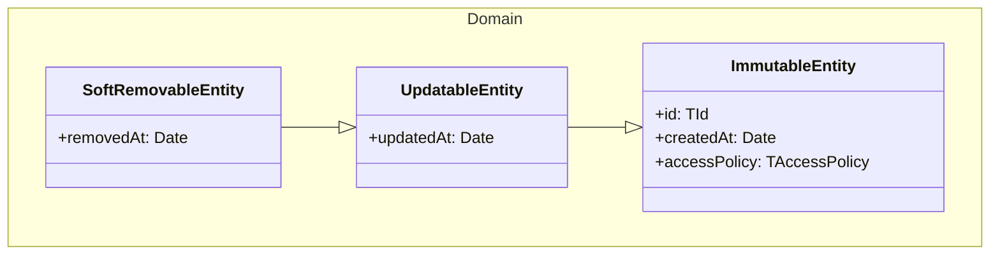

# PureArchitecture

A simplified Clean Architecture implementation using PureTrace for TypeScript applications.



## ESLint Configuration for Clean Architecture

This package includes an ESLint configuration that enforces Clean Architecture layer boundaries.

### Installation

If using the full `@gilles-coudert/pure-architecture` package, the ESLint config is already included.

```bash
npm install --save-dev @gilles-coudert/pure-architecture eslint-plugin-import
```

### Important note about ESLint plugins

If you use ESLint Flat Config (ESLint 9+), you must declare plugins like `import` at the root of your configuration (e.g. `plugins: ['import']`).
This is required for custom rules and overrides to work, even if it seems less modular. Official presets like `typescript-eslint` work without this because they internally include their plugin reference, but your own rules and overrides need the plugin declared globally. See the [ESLint documentation](https://eslint.org/docs/latest/use/configure/plugins#configuring-plugins) for details.

### Usage

#### Flat Config (ESLint 9+)

```javascript
// eslint.config.js
import architectureConfig from '@gilles-coudert/pure-architecture/eslint-config';

export default [
    ...architectureConfig.overrides,
    // Your other configs...
];
```

#### Legacy Config (.eslintrc)

```json
{
    "extends": ["@gilles-coudert/pure-architecture/eslint-config"]
}
```

### Rules Enforced

#### Domain Layer (`src/domain/**`)

- ❌ Cannot import from `application`
- ❌ Cannot import from `application_boundary`
- ❌ Cannot import from `infrastructure`
- ❌ Cannot import from `presentation`
- ❌ Cannot import from `infrastructure_boundary`
- ✅ Pure business logic only

#### Application Boundary Layer (`src/application_boundary/**`)

- ✅ Can import from `domain`
- ✅ Can import from `common` (technical factorizations)
- ❌ Cannot import from `application` (implementations)
- ❌ Cannot import from `infrastructure`
- ❌ Cannot import from `infrastructure_boundary`
- ❌ Cannot import from `presentation`
- ✅ **Contracts only** (interfaces, types for use cases)

#### Application Layer (`src/application/**`)

- ✅ Can import from `domain`
- ✅ Can import from `application_boundary` (contracts)
- ✅ Can import from `common` (technical factorizations)
- ✅ Can import from `infrastructure_boundary` (contracts)
- ❌ Cannot import from `infrastructure` (implementations)
- ❌ Cannot import from `presentation`

#### Infrastructure Layer (`src/infrastructure/**`)

- ✅ Can import from `domain`
- ✅ Can import from `application`
- ✅ Can import from `application_boundary` (contracts)
- ✅ Can import from `common`
- ✅ Can import from `infrastructure_boundary`
- ❌ Cannot import from `presentation`

#### Presentation Layer (`src/presentation/**`)

- ✅ Can import from `application_boundary` (use case contracts)
- ✅ Can import from `common`
- ✅ Can import from `infrastructure_boundary`
- ❌ Cannot import from `domain`
- ❌ Cannot import from `application` (use implementations via application_boundary)
- ❌ Cannot import from `infrastructure` (implementations)

### Customization

You can override specific rules in your project:

```javascript
import architectureConfig from '@gilles-coudert/pure-architecture/eslint-config';
import importPlugin from 'eslint-plugin-import';

export default [
    {
        files: ['src/domain/**/*.ts'],
        plugins: {
            import: importPlugin,
        },
        rules: {
            // Your custom rules
        },
    },
    ...architectureConfig.overrides,
];
```

### Layers Structure

- **`common/`**: Technical factorizations shared across layers (Parameters, shared types, Culture)
- **`domain/`**: Pure business logic - Entities and domain rules with no external dependencies
- **`application_boundary/`**: Contracts and interfaces exposing use cases to outer layers (FindByIdUseCase, CreateUseCase, etc.)
- **`application/`**: Business use cases/interactors implementing the application_boundary contracts
- **`infrastructure_boundary/`**: Contracts for infrastructure services (Repository, Mapper, etc.)
- **`infrastructure/`**: Actual implementations of infrastructure services (database, external APIs)
- **`presentation/`**: Controllers, views, API endpoints - can only depend on application_boundary and common
